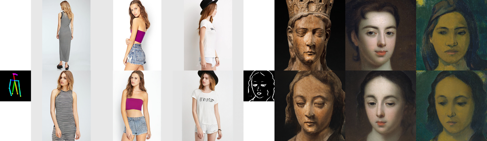

# CoCosNet v2: Full-Resolution Correspondence Learning for Image Translation (CVPR 2021, oral presentation)<br>


**CoCosNet v2: Full-Resolution Correspondence Learning for Image Translation**<br>
**CVPR 2021, oral presentation**<br>
[Xingran Zhou](http://xingranzh.github.io/), [Bo Zhang](https://bo-zhang.me/), [Ting Zhang](https://www.microsoft.com/en-us/research/people/tinzhan/), [Pan Zhang](https://panzhang0212.github.io/), [Jianmin Bao](https://jianminbao.github.io/), [Dong Chen](https://www.microsoft.com/en-us/research/people/doch/), [Zhongfei Zhang](https://www.cs.binghamton.edu/~zhongfei/), [Fang Wen](https://www.microsoft.com/en-us/research/people/fangwen/)<br>
### [Paper](https://arxiv.org/pdf/2012.02047.pdf)  | [Slides](https://github.com/xingranzh/xingranzh.github.io/blob/master/slides/cocosnet_v2_slides.pdf)<br>
## Abstract
> We present the full-resolution correspondence learning for cross-domain images, which aids image translation. We adopt a hierarchical strategy that uses the correspondence from coarse level to guide the fine levels. At each hierarchy, the correspondence can be efficiently computed via PatchMatch that iteratively leverages the matchings from the neighborhood. Within each PatchMatch iteration, the ConvGRU module is employed to refine the current correspondence considering not only the matchings of larger context but also the historic estimates. The proposed CoCosNet v2, a GRU-assisted PatchMatch approach, is fully differentiable and highly efficient. When jointly trained with image translation, full-resolution semantic correspondence can be established in an unsupervised manner, which in turn facilitates the exemplar-based image translation. Experiments on diverse translation tasks show that CoCosNet v2 performs considerably better than state-of-the-art literature on producing high-resolution images.
## Installation
First please install dependencies for the experiment:
```bash
pip install -r requirements.txt
````
We recommend to install Pytorch version after `Pytorch 1.6.0` since we made use of [automatic mixed precision](https://pytorch.org/docs/stable/amp.html) for accelerating. (we used `Pytorch 1.7.0` in our experiments)<br>
## Prepare the dataset
First download the Deepfashion dataset (high resolution version) from [this link](https://drive.google.com/file/d/1bByKH1ciLXY70Bp8le_AVnjk-Hd4pe_i/view?usp=sharing). Note the file name is `img_highres.zip`. Unzip the file and rename it as `img`.<br>
If the password is necessary, please contact [this link](http://mmlab.ie.cuhk.edu.hk/projects/DeepFashion.html) to access the dataset.<br>
We use [OpenPose](https://github.com/Hzzone/pytorch-openpose) to estimate pose of DeepFashion(HD). We offer the keypoints detection results used in our experiment in [this link](https://drive.google.com/file/d/1wxrqyb67Xu_IPyZzftLgBPHDTKGQP7Pk/view?usp=sharing). Download and unzip the results file.<br>
Since the original resolution of DeepfashionHD is 750x1101, we use a Python script to process the images to the resolution 512x512. You can find the script in [`data/preprocess.py`](https://github.com/microsoft/CoCosNet-v2/blob/main/data/preprocess.py). Note you need to download our train-val split lists `train.txt` and `val.txt` from [this link](https://drive.google.com/drive/folders/15NBujOTLnO_cRoAufWPqtOWKIinCKi0z?usp=sharing) in this step.<br>
Download the train-val lists from [this link](https://drive.google.com/drive/folders/15NBujOTLnO_cRoAufWPqtOWKIinCKi0z?usp=sharing), and the retrival pair lists from [this link](https://drive.google.com/drive/folders/1dJU8iq8kFiwq33nWtvj5Ql5rUh9fiXUi?usp=sharing). Note `train.txt` and `val.txt` are our train-val lists. `deepfashion_ref.txt`, `deepfashion_ref_test.txt` and `deepfashion_self_pair.txt` are the paring lists used in our experiment. Download them all and move below the folder `data/`.<br>
Finally create the root folder `deepfashionHD`, and move the folders `img` and `pose` below it. Now the the directory structure is like:<br>
```
deepfashionHD
│
└─── img
│   │
│   └─── MEN
│   │   │   ...
│   │
│   └─── WOMEN
│       │   ...
│   
└─── pose
│   │
│   └─── MEN
│   │   │   ...
│   │
│   └─── WOMEN
│       │   ...

```
## Inference Using Pretrained Model
The inference results are saved in the folder `checkpoints/deepfashionHD/test`. Download the pretrained model from [this link](https://drive.google.com/file/d/1ehkrKlf5s1gfpDNXO6AC9SIZMtqs5L3N/view?usp=sharing).<br> 
Move the models below the folder `checkpoints/deepfashionHD`. Then run the following command. 
````bash
python test.py --name deepfashionHD --dataset_mode deepfashionHD --dataroot dataset/deepfashionHD --PONO --PONO_C --no_flip --batchSize 8 --gpu_ids 0 --netCorr NoVGGHPM --nThreads 16 --nef 32 --amp --display_winsize 512 --iteration_count 5 --load_size 512 --crop_size 512
````
The inference results are saved in the folder `checkpoints/deepfashionHD/test`.<br>
## Training from scratch
Make sure you have prepared the DeepfashionHD dataset as the instruction.<br>
Download the **pretrained VGG model** from [this link](https://drive.google.com/file/d/1D-z73DOt63BrPTgIxffN6Q4_L9qma9y8/view?usp=sharing), move it to `vgg/` folder. We use this model to calculate training loss.<br>

Run the following command for training from scratch.
````bash
python train.py --name deepfashionHD --dataset_mode deepfashionHD --dataroot dataset/deepfashionHD --niter 100 --niter_decay 0 --real_reference_probability 0.0 --hard_reference_probability 0.0 --which_perceptual 4_2 --weight_perceptual 0.001 --PONO --PONO_C --vgg_normal_correct --weight_fm_ratio 1.0 --no_flip --video_like --batchSize 16 --gpu_ids 0,1,2,3,4,5,6,7 --netCorr NoVGGHPM --match_kernel 1 --featEnc_kernel 3 --display_freq 500 --print_freq 50 --save_latest_freq 2500 --save_epoch_freq 5 --nThreads 16 --weight_warp_self 500.0 --lr 0.0001 --nef 32 --amp --weight_warp_cycle 1.0 --display_winsize 512 --iteration_count 5 --temperature 0.01 --continue_train --load_size 550 --crop_size 512 --which_epoch 15
````
Note that `--dataroot` parameter is your DeepFashionHD dataset root, e.g. `dataset/DeepFashionHD`.<br>
We use 8 32GB Tesla V100 GPUs to train the network. You can set `batchSize` to 16, 8 or 4 with fewer GPUs and change `gpu_ids`. 
## Citation
If you use this code for your research, please cite our papers.
```
@InProceedings{Zhou_2021_CVPR,
author={Zhou, Xingran and Zhang, Bo and Zhang, Ting and Zhang, Pan and Bao, Jianmin and Chen, Dong and Zhang, Zhongfei and Wen, Fang},
title={CoCosNet v2: Full-Resolution Correspondence Learning for Image Translation},
booktitle={Proceedings of the IEEE/CVF Conference on Computer Vision and Pattern Recognition (CVPR)},
year={2021},
pages={11465-11475}
}
```

Also, welcome to refer to our [CoCosNet v1](https://github.com/microsoft/CoCosNet):
```
@InProceedings{Zhang_2020_CVPR,
author={Zhang, Pan and Zhang, Bo and Chen, Dong and Yuan, Lu and Wen, Fang},
title={Cross-Domain Correspondence Learning for Exemplar-Based Image Translation},
booktitle={Proceedings of the IEEE/CVF Conference on Computer Vision and Pattern Recognition (CVPR)},
year={2020},
pages={5143-5153}
}
```

## Acknowledgments
*This code borrows heavily from [CocosNet](https://github.com/microsoft/CoCosNet) and [DeepPruner](https://github.com/uber-research/DeepPruner).
We also thank [SPADE](https://github.com/NVlabs/SPADE) and [RAFT](https://github.com/princeton-vl/RAFT).*
## License
The codes and the pretrained model in this repository are under the MIT license as specified by the LICENSE file.<br>
This project has adopted the [Microsoft Open Source Code of Conduct](https://opensource.microsoft.com/codeofconduct/). For more information see the [Code of Conduct FAQ](https://opensource.microsoft.com/codeofconduct/faq/) or contact [opencode@microsoft.com](mailto:opencode@microsoft.com) with any additional questions or comments.
